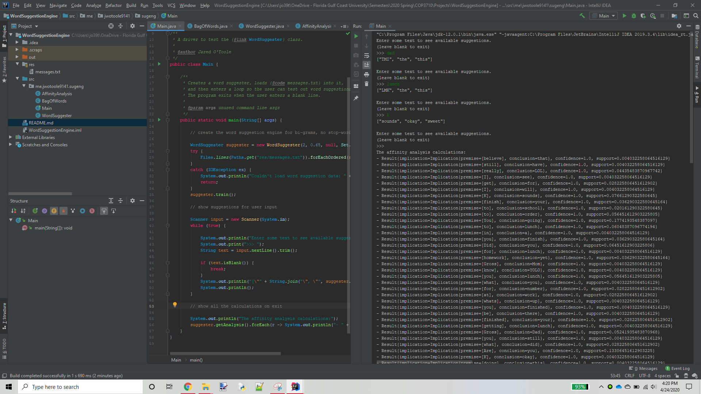

# Word Suggestion Engine

This is a project for Prof. Greenwell's COP3710 Intro to Data Engineering course at Florida Gulf Coast University, Spring 2020

> Build a small version of something everyone with a cellphone uses daily: A word suggestion engine, extending the analytic work performed in previous assignments.

- [AffinityAnalysis.java](src/me/jwotoole9141/sugeng/AffinityAnalysis.java)
- [BagOfWords.java](src/me/jwotoole9141/sugeng/BagOfWords.java)
- [Main.java](src/me/jwotoole9141/sugeng/Main.java)
- [WordSuggester.java](src/me/jwotoole9141/sugeng/WordSuggester.java)
- [messages.txt](res/messages.txt)
- [output.txt](res/output.txt)

